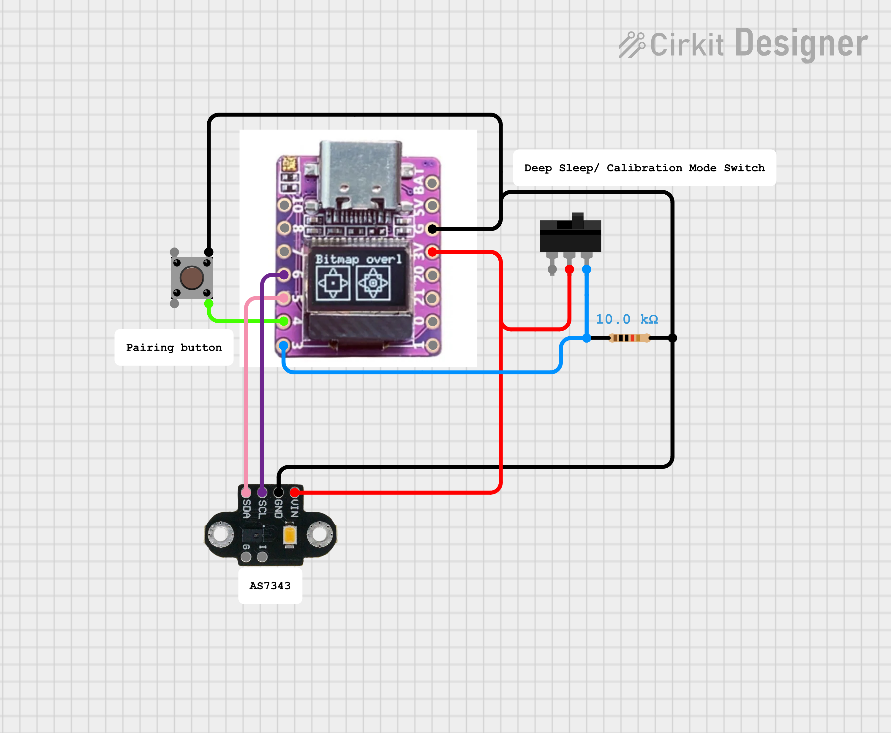

# Párování slave s hubem

Pokud je slave úplně nový, tak je potřeba zmáčknout `pairing button` na 3 sekundy čímž ho dáme do párovacího módu. Kde jakmile přijmé první zprávu `ping` od hubu, tak se párování ukončí a slave bude přijímat kalibrační data pouze od hubu.

## Zapojení

### Spektrálního senzoru

### Půdního senzoru

# Komunikace

### Poslání kalibračních hodnot

1. 1x se zmáčkne tlačítko `Get calibration data`, pokud se nezobrazí všechny hodnoty, tak se zmáčkne tlačítko znovu.
2. Počká se ať že všechny hodnoty aktualizují
3. Úpraví se hodnoty a poté se zmáčkne tlačíkot `Send calibration data`
