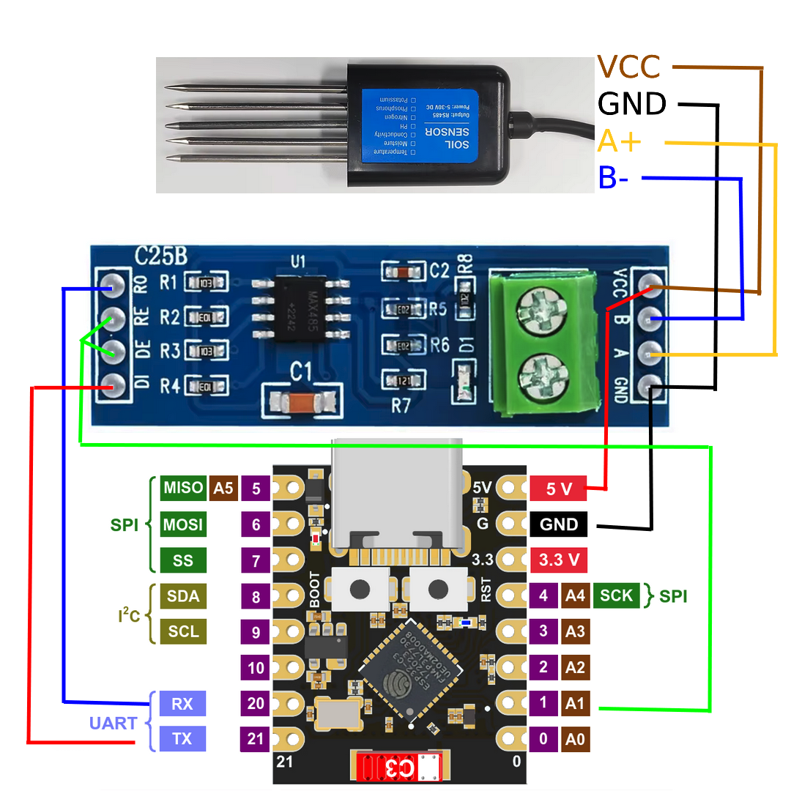
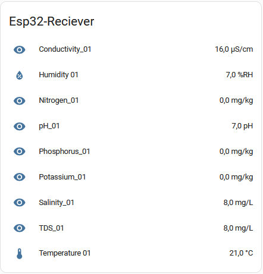
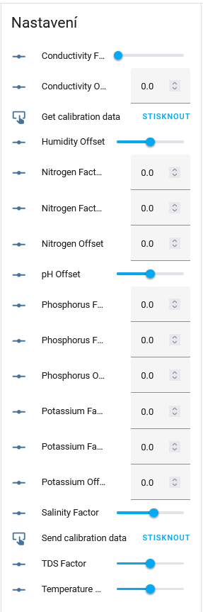

## Schéma

## Home Assitant
# Výstup hodnot

# Poslání kalibračních hodnot
1. 2x se zmáčkne tlačítko `Get calibration data`
2. Počká se ať že všechny hodnoty aktualizují
3. Úpraví se hodnoty a poté se zmáčkne tlačíkot `Send calibration data`

